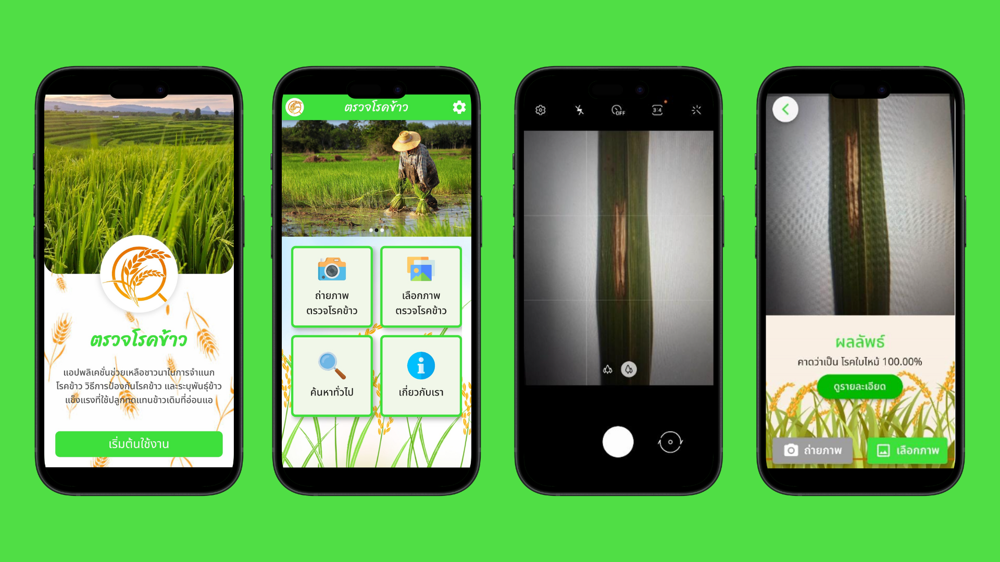

# Flutter Detection Rice Disease

## About The Project
 

The Detection Rice Disease application is a tool designed for farmers to identify rice diseases using image processing and deep learning. This AI-powered technology offers more accurate disease classification than visual inspection.

Real-time object detection in Flutter using [camera](https://pub.dartlang.org/packages/camera) and [tflite](https://pub.dartlang.org/packages/tflite) plugin. 

## Getting Started

### Installation

```
flutter packages get
```

### Run Project

```
flutter run
```

## Models

- Image Classification
  - MobileNet


